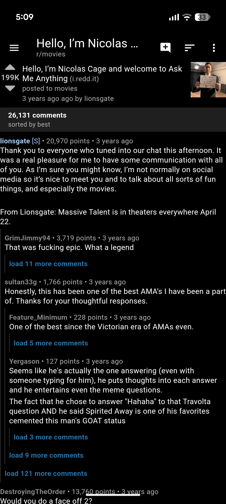

# Lurk

A Reddit, Digg, and Lemmy app for Android created with Flutter. Heavily inspired by the discontinued app Reddit is Fun (RIF).

## Disclaimer
Reddit has made efforts to phase-out third party apps and Digg very recently relaunched so I wouldn't be surprised if things break or requests get blocked.

I created this mainly out of boredom and have focused most on functionality that I personally used in RIF. Only tested on a Pixel 10 Pro.

## Versions
There are 4 versions/APKs included with each release - a standalone Reddit app, a standalone Digg app, a standalone Lemmy app, and one that combines all three.

## Screenshots

 &nbsp; &nbsp;  &nbsp; &nbsp;  &nbsp; &nbsp; 
